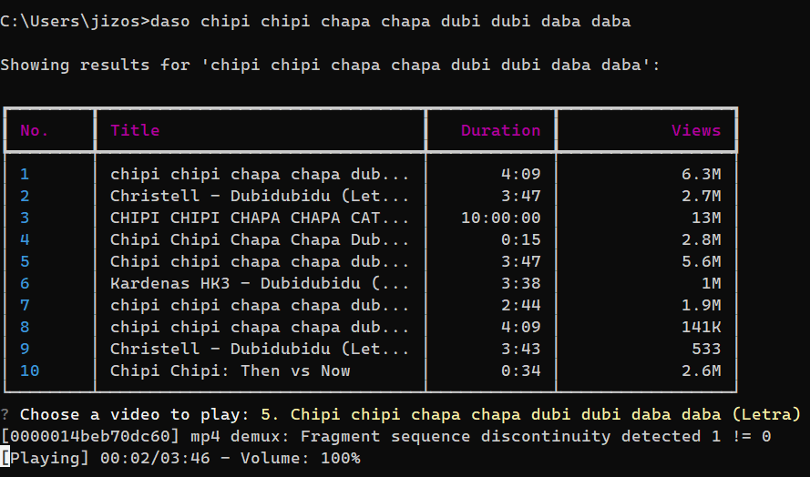
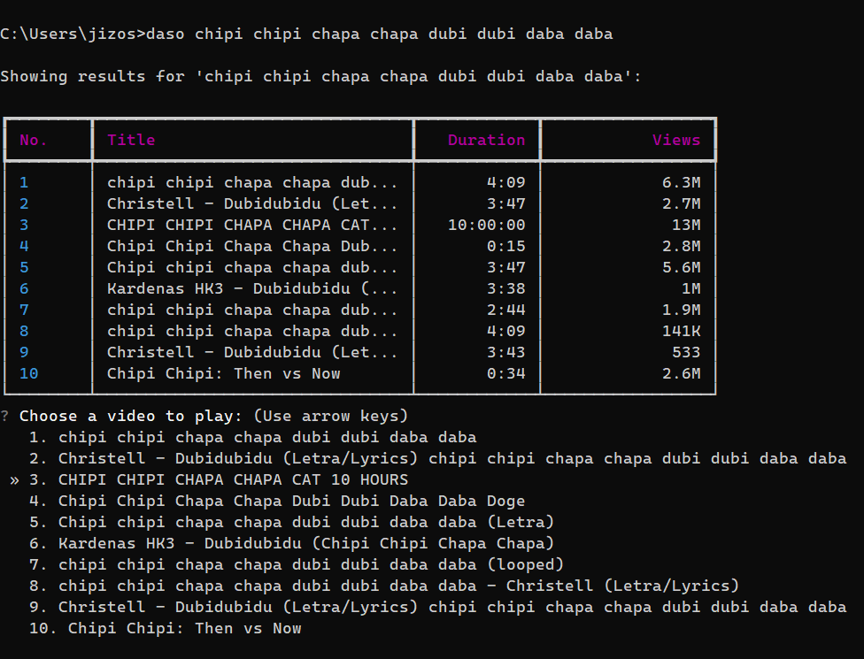

<h1 align="center">
  <br>DASO
</h1>

<p align="center">
  <strong>DASO - Stream music from YouTube directly from your terminal.</strong>
</p>

<div align="center">
  
</div>

## Table of Contents

- [Installation](#-installation)
- [Usage](#-usage)
- [Keybinds](#-keybinds)
- [Important Notes](#-important-notes)
- [Contributing](#-contributing)
- [License](#-license)

## 🚀 Installation

DASO is easy to install with its dedicated installer for Windows. Follow these steps:

1. **Choose Your Installer**:
   - `daso_installer_no_python.bat`: If you already have Python installed.
   - `daso_installer_python.bat`: If you don't have Python. [Install Python here](https://www.python.org/downloads/) in case it doesn't work.
2. **Run the Installer**: Double-click the chosen .bat file in the main folder.
3. **Installation Complete**: DASO is now ready to use!

> 📝 **Note**: Currently, DASO is not available for Linux or Mac. There are no plans for these platforms at the moment.

## 🎵 Usage

The DASO installer makes it so that you can run it from anywhere in your terminal. Basically, it adds a new command to your terminal, `daso`, which you can use to run like this:

```bash
daso [song name]
```

For example:

```bash
daso never gonna give you up
```

DASO uses the YouTube API to search for the song you want to listen to, so you can use any name you want, as long as it exists on YouTube. Remember tho, to provide a name, else you will get an error.

### 🎹 Keybinds

DASO has some keybinds that you can use to control it while it's running. Here's a list of them:

- `space` to pause/play the song
- `ctrl + c` to stop the song and exit DASO
- `arrow up` to increase the volume
- `arrow down` to decrease the volume

<div align="center">
  
</div>

## ❗ Important

The neat thing about DASO is that it doesn't download the song you want to listen to, it just streams it from YouTube. Another important note is that you can't listen to Lives _for now_, I'm currently figuring out how to implement this feature. If you know how to, please feel free to [contribute](#contributing)!

## 🤝 Contributing

I welcome all types of contributions, including documentation, code, tests, suggestions, etc.... Other than that, you can also open an issue if you find a bug or if you have a suggestion, I'll try to answer as soon as possible.

## 📝 License

[MIT](LICENSE)